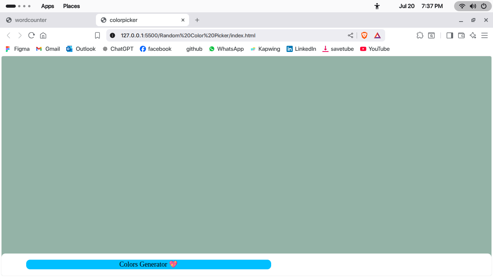
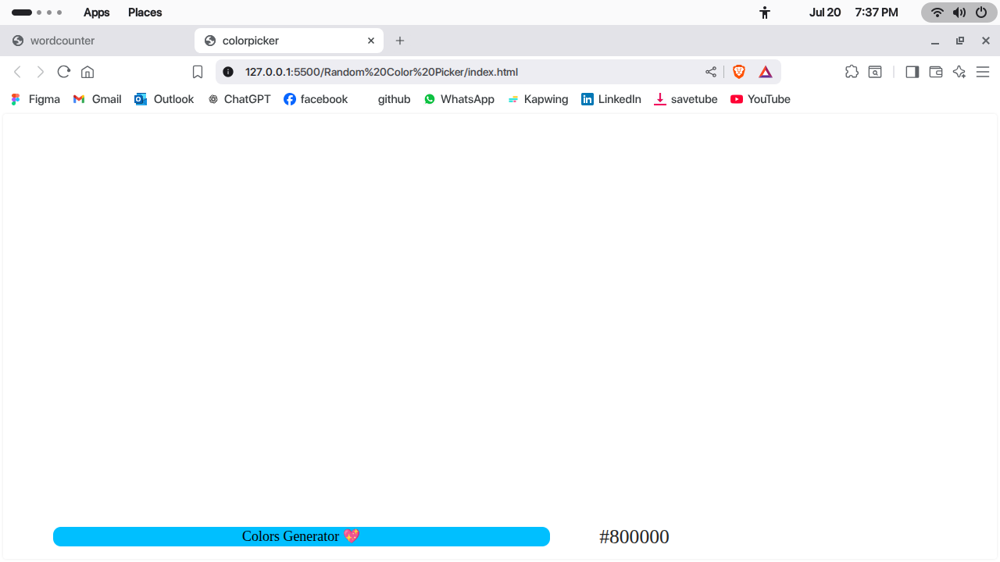

# Random Color Picker

A simple JavaScript project to pick and display random colors.

## Features

- Generates random colors on button click
- Displays color code (HEX/RGB)
- Easy to use interface

## Usage

1. Clone the repository.
2. Open `index.html` in your browser.
3. Click the button to pick a random color.

## Screenshot
 
  

## License

MIT