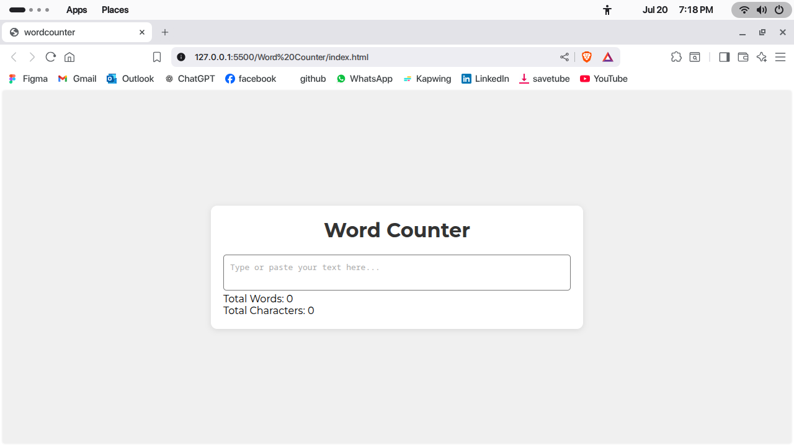
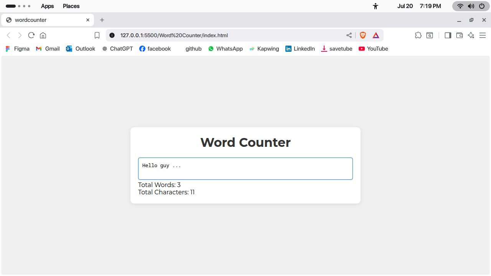

<h1>Word Counter</h>

Develop an app that provides an input field or text area for the user to
type. Display the number of words in real time on the screen as the
user types.

**Simple but example of regex js**

   